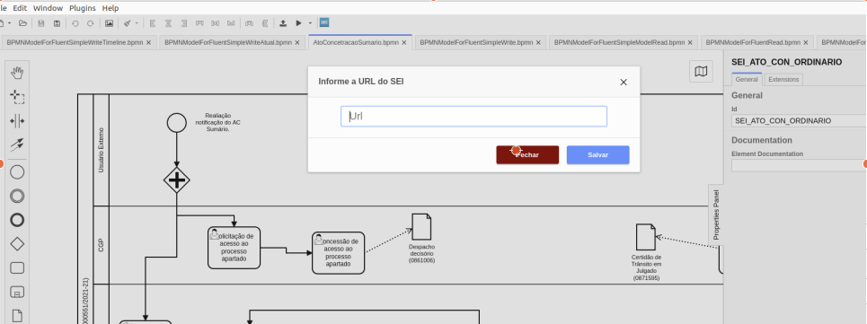

# sei-camunda-modeler
Plugin de Integração do Camunda Modeler com o SEI.
Plugin acessório para uso do Camunda BPM Plataform integrado ao SEI.

## Objetivo
 - Modelador com funcionalidades simplificadoras para analistas de negócio.
 - Integração com API SEI (Grupos, Usuários, Processos, Documentos, etc)

## Instalação

### Requisitos
 Camunda Modeler 4.8.
 Download em https://downloads.camunda.cloud/release/camunda-modeler/4.8.1/camunda-modeler-4.8.1-linux-x64.tar.gz

### Passo a Passo de instalação.
1) Acesse  seção de realeases (https://github.com/projeto-cade-unb/sei-camunda-modeler/releases) e baixe o arquivo sei-camunda-modeler.zip 
2) Descompacte o arquivo  sei-camunda-modeler.zip  no direório de plugins do Camunda Modeler
   <installdirmodeler>resources/plugins/
3) Inicie o Camunda Modeler.

## Como Usar 

#### Requisitos
Ter um SEI instalado com o modulo de API Camunda SEI.

### Passo a Passo

1) Acesse na barra inferior o "Configuração SEI"
2) Informa a URL do SEI.
3) Clique no icone SEI na barra superior.
4) Informe usuário e senha de autenticação no SEI. 

## Funcionalidades
O Plugin se conecta a um modulo personalizado de API desenvolvido no SEI que expoem alguns objetos.

## User Task
As User Task podem selecionar alguns parametros do BPMN direto do SEI.

### Assigner
  - Lista de Usuários do SEI via RESP/API.

### Candidate User
  - Lista de Usuários do SEI via RESP/API.

### Candidate Groups
  - Lista de Cargos do SEI via RESP/API.

### Documento SEI
  - Lista de Documentos do SEI via API REST

### Tipo do Documento SEI
- tipdoc - Documento do SEI.
- email - Documento o SEI anexo ao email.

Quando Selecionado Id = Deve ser o calculo de Activity_TipodoDocumento_IddoDocumentoSEI.

## Process
Permite selecionar o Processo do SEI
- Lista de Processos do SEI

## Documento SEI de Início.
- Lista de Documentos do SEI via API REST
Quando Selecionado Id = Deve ser o calculo de SEI_IdTipoProcesso_IddoDocumentoSEI.

## Build

export NODE_OPTIONS=--openssl-legacy-provider
npm run all
